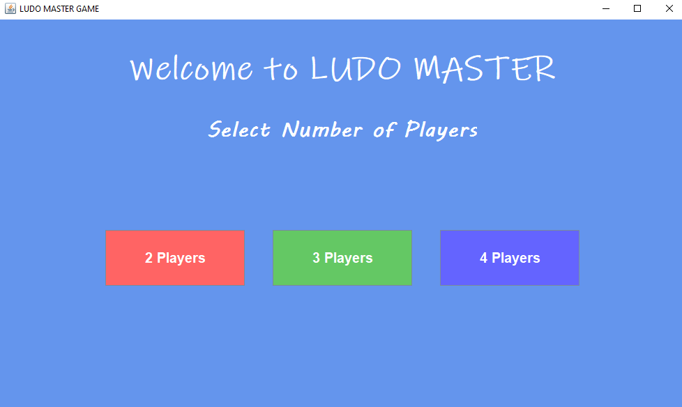
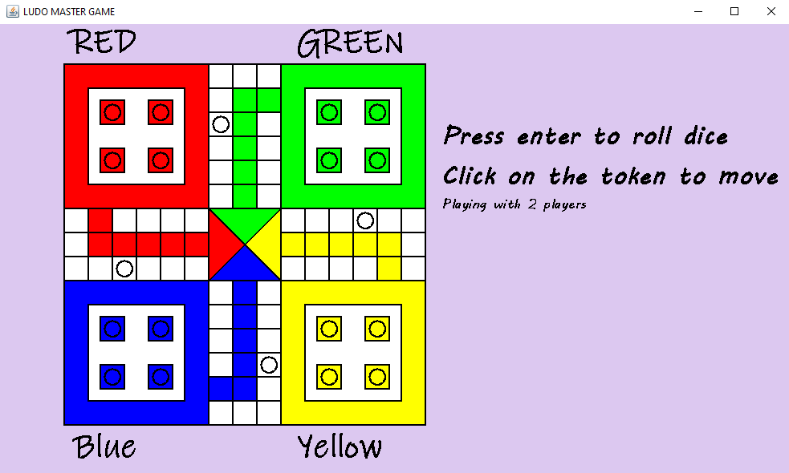
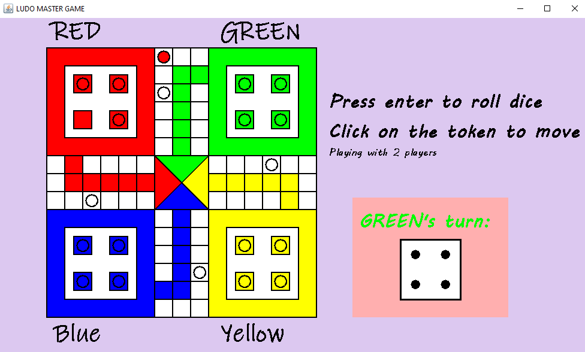

# 🎲 Ludo Master (Java)

## 📖 Overview

**Ludo Master** is a desktop-based Ludo game developed using **Java Swing** and **AWT**. The application provides an interactive graphical user interface with animated dice, player selection, token movement, turn management, and winning logic. The project demonstrates object-oriented programming concepts and event-driven programming in Java.

---

## ✨ Features

- 🎮 Interactive Ludo game interface
- 👥 Supports 2, 3, and 4 players
- 🎲 Animated dice rolling
- 🚶 Token movement based on dice value
- 🔄 Automatic turn switching
- ⚔️ Token collision (kill) logic
- 🏆 Winning condition detection
- 🖥️ User-friendly Java Swing GUI

---

## 🛠️ Technologies Used

- Java
- Java Swing
- Java AWT
- Object-Oriented Programming (OOP)
- Event-Driven Programming

---

## 📸 Screenshots

### Home Screen



### Gameplay



### Winner Screen



---


## 📂 Project Structure

```
Ludo-Master-Java/
│
├── src/
│   ├── Ludo.java
│   ├── GameMoves.java
│   ├── Player.java
│   ├── Pawn.java
│   ├── Path.java
│   ├── Layout.java
│   ├── Dice.java
│   └── PlayerSetupPanel.java
│
├── Documentation/
│   └── LUDO_MASTER_Project_Report.pdf
│
├── README.md
├── LICENSE
└── .gitignore
```

---

## 🚀 How to Run

1. Clone the repository.

```bash
git clone https://github.com/devtusharhq/ludo-master-java.git
```

2. Open the project in Visual Studio Code or any Java IDE.

3. Compile all Java files.

```bash
javac *.java
```

4. Run the main class.

```bash
java Ludo
```

---

## 📚 Learning Outcomes

This project strengthened my understanding of:

- Java GUI development using Swing and AWT
- Object-Oriented Programming (OOP)
- Event handling (Keyboard, Mouse, Timer)
- Game logic implementation
- Java Graphics (Graphics2D)
- Software design and modular programming

---

## 📄 Documentation

The repository includes a detailed project report explaining:

- System architecture
- Class-wise implementation
- GUI design
- Game logic
- Event handling
- Screenshots
- Future scope

---

## 👨‍💻 Developed By

**Tushar L. Devendra**

B.Sc. Information Technology  
SVKM's Usha Pravin Gandhi College (Mumbai University)

🔗 GitHub Profile  
https://github.com/devtusharhq

---

## ⭐ Support

If you found this project useful, consider giving it a ⭐ on GitHub.
